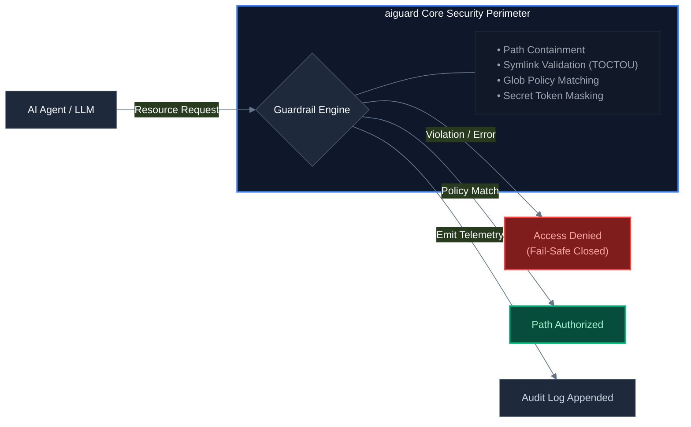

# 🛡️ @syedahmedx3/aiguard

A zero-dependency, type-safe, fail-safe closed security guardrail for AI agents and LLM applications. This package protects local application execution paths from directory traversal attacks, accidental sensitive resource leakage, or unauthorized system access by enforcing strict runtime security bounds.

[](https://opensource.org/licenses/MIT)
[](https://www.npmjs.com/package/@syedahmedx3/aiguard)



## Features

*  **Fail-Safe Closed Invariants:** Engineered so that any unexpected error, edge case, or misconfiguration results in strict access denial by default.
*  **Path Containment Enforcement:** Hardens file boundaries by actively preventing directory traversal (`../`), null-byte manipulation, and malicious URL-style paths.
*  **Symlink Attack Mitigation:** Validates file descriptors atomically post-open to neutralize Time-of-Check to Time-of-Use (**TOCTOU**) race conditions.
*  **Policy Engine:** Evaluates pattern matching against a dedicated `.aipolicy` file using robust, high-performance glob mechanics via `minimatch`.
*  **Structured Auditing:** Features built-in, low-overhead memory buffers and appending file-based audit logging sinks.
*  **Secret Redaction (Phase 3):** Opt-in structural text masking designed to filter high-risk tokens (e.g., `OPENAI_API_KEY`, private keys) from agent outputs.
*  **Interactive Consent (Phase 4):** Provides an asynchronous hook architecture ("Ask Mode") to support real-time, human-in-the-loop authorization flows.

---

## Tech Stack & Prerequisites

* **Runtime Support:** Node.js `>= 18.0.0` (LTS recommended)
* **Language:** TypeScript `^5.0.0` / JavaScript (ES6+)
* **Dependencies:** Zero external production dependencies (except bundled internal utilities)

---

## Getting Started

### Installation

Install the package via your preferred package manager:

```bash
npm install @syedahmedx3/aiguard
